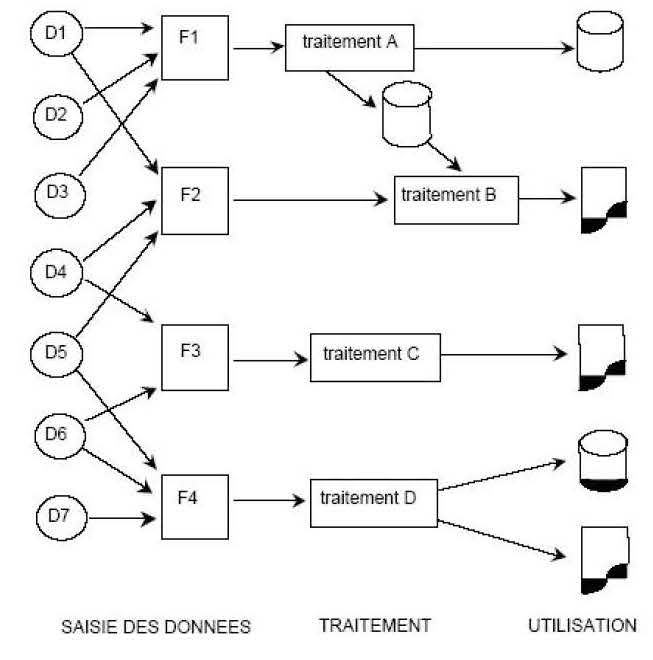
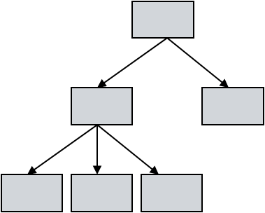
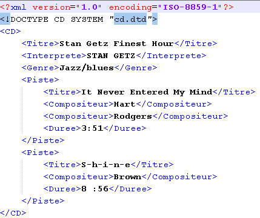
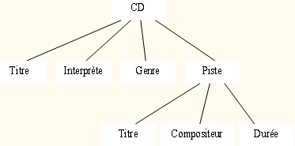
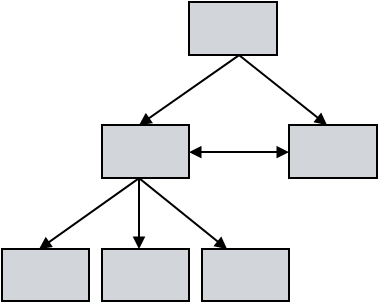
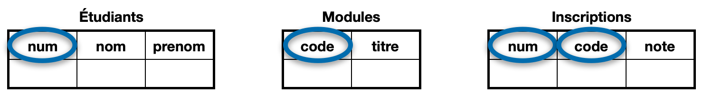
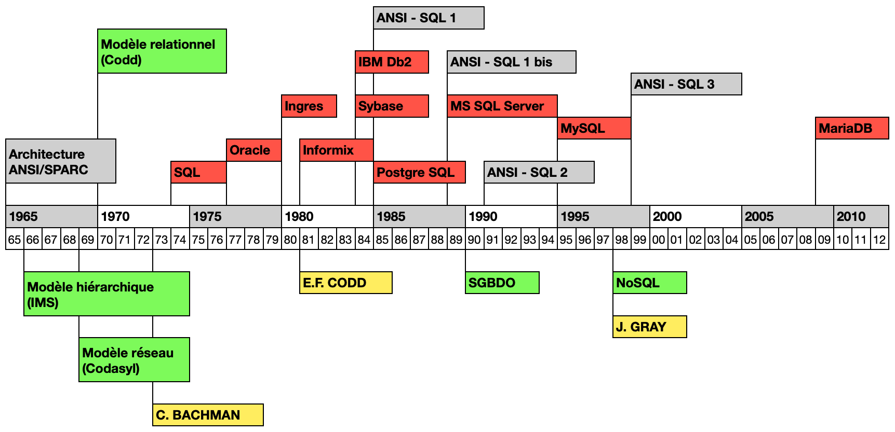
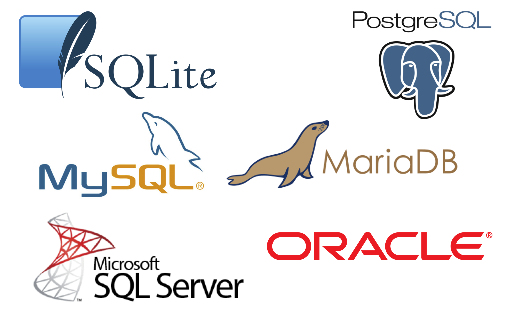
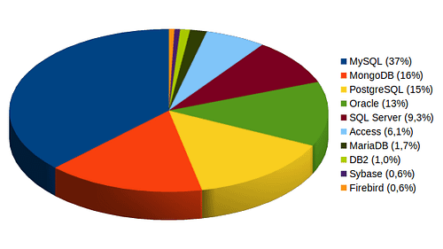

# Principaux concepts des systèmes de gestion de bases de données

## 1. Les modèles de bases de données

### 1.1 Origine

Dès le début, l'informatique tend à construire des systèmes pour effectuer des calculs : équations différentielles, calcul matriciel… Jusque dans les années 1960, l’approche classique de mise en place d’une application informatique dans une entreprise consistait le plus souvent à l’écriture d’un certain nombre de programmes destinés à l’exploitation d’un ensemble de fichiers qu’il fallait aussi créer. Les principaux problèmes posés par cette démarche sont : la **redondance** des informations et la **dépendance** entre les données et les programmes qui les manipulent.

Une **base de données** est un ensemble d’informations stocké sur un système informatique. Cet ensemble est implanté physiquement sous la forme d’un ou plusieurs fichiers. Cette organisation est assurée par un logiciel spécialisé, le **Système de Gestion de Base de Données** ou **SGBD**.

Les données peuvent être de natures diverses, les opérations plus ou moins compliquées et le nombre d’utilisateurs plus ou moins important :
- applications de gestion (paye, stock…),
- applications transactionnelles (banque, réservation…),
- applications de documentation (bibliothèque, cartographie…),
- Ingénierie (PAO, CAO…).

Historiquement, l’organisation sémantique des informations a été réalisée suivant plusieurs modèles de données. Les principaux modèles de base de données sont les suivants :
- le modèle hiérarchique,
- le modèle réseau,
- le modèle relationnel,
- le modèle objet,
- le modèle nosql.

La tendance actuelle conduit vers la gestion de grandes voire très grandes quantités d'informations, le Big data. Les volumes des données sont tellement importants que les solutions classiques de gestion de bases de données en deviennent obsolètes. 

### 1.2 Le modèle hiérarchique

Le modèle de données hiérarchique a été conçu dans les années 60 à la NASA pour la gestion des données du programme spatial Apollo. Les données y sont classées hiérarchiquement, selon une arborescence descendante. Ce modèle utilise des pointeurs entre les différents enregistrements : à chaque enregistrement correspond un enregistrement parent.

Ce modèle est bien adapté à des données de type nomenclatures avec une relation 1 vers N, mais inapproprié aux structures de données complexes.

Les fichiers XML, Extensible Markup Language (langage de balisage extensible) constituent une réminiscence de ces bases de données hiérarchiques.

### 1.3 Le modèle réseau

Ce modèle constitue une extension du modèle hiérarchique, il utilise des pointeurs vers des enregistrements selon une structure arborescente. Il est cependant possible d’établir des liens sans restriction entre les différents éléments. Imaginée par Charles Bachman, sa spécification a été publiée en 1969 par le consortium Codasyl, à l’origine du langage Cobol.

Un enregistrement de type parent dispose d’un pointeur vers chacun des membres de sa descendance. Chaque membre de la descendance dispose d’un pointeur vers son aîné et d’un autre vers son cadet.

Plus que le modèle hiérarchique, le modèle réseau implique une connaissance de la structure de la base de données pour permettre l’accès aux données : les logiciels sont dépendants de la structure de la base.

### 1.4 Le modèle relationnel

Ce modèle est fondé sur la théorie mathématique des relations. Il peut être vu comme un ensemble de tables ou relations à n colonnes, n désignant le degré de la relation. Une table sert à représenter aussi bien une classe d’objets qu’une association entre des classes d’objets. Chaque élément d’une table est appelé un n-uplet.

Dans l’exemple ci-dessus, la table **Inscriptions** décrit l’association entre la classe d’objets **Étudiants** et la classe **Modules**. Elle permet de modéliser le fait qu’un étudiant peut s’inscrire à aucun, un, ou plusieurs modules. Ce modèle est le plus fréquent et sera détaillé plus loin.

Les logiciels qui s’appuient sur ce modèle sont les SGBDR, avec un R pour relationnel. Le langage dédié aux opérations sur les données est le SQL, Structured Query Language.

### 1.5 Le modèle objet

La notion de bases de données objet date des années 1990. Les données sont représentées sous forme d'objets : ils contiennent les données qui les décrivent ainsi que la logique qui permet de les utiliser ou de les modifier. Chaque enregistrement de la base de données constitue une instance de la classe d’objets correspondante. Ces instances sont classées de manière hiérarchique dans la base de données.

Les Systèmes de Gestion de Bases de Données Objet ou SGBDO purs n'ont pas réussi à remplacer les SGBDR. Ils restent globalement cantonnés à des niches telles que l’ingénierie, les études spatiales, ou encore la recherche fondamentale en physique et en biologie moléculaire. Les annuaires LDAP (Lightweight Directory Access Protocol. protocole permettant l'interrogation et la modification des services d'annuaire) utilisent une base de données objet.

### 1.6 Le modèle nosql
La définition exacte de la famille des SGBD NoSQL reste sujette à débat. Le terme se rattache autant à des caractéristiques techniques qu'à une génération historique de SGBD qui a émergé autour des années 2010. La raison principale de l'émergence et de l'adoption des SGBD NoSQL serait le développement des centres de données et la nécessité de posséder un paradigme de bases de données adapté à ce modèle d'infrastructure matérielle. Ils sont utilisés par de grands acteurs comme Google ou FaceBook.

L'architecture machine en clusters induit une structure logicielle distribuée fonctionnant avec des agrégats répartis sur différents serveurs permettant des accès et modifications concurrents, mais imposant également de remettre en cause de nombreux fondements de l'architecture SGBD relationnelle traditionnelle.

### 1.7 Chronologie

## 2. Les SGBDR

Les SGBD relationnels sont à l’heure actuelle les plus diffusés sur le marché. Ils permettent d’organiser les données sous forme de tables et servent à effectuer des opérations ordinaires telles que consulter, modifier, construire, organiser, transformer, copier, sauvegarder ou restaurer des bases de données.

Les systèmes de gestion de bases de données relationnelles les plus utilisés sont :

- SQLite, moteur très léger prévu pour des petites bases et destiné à être intégré directement dans les programmes,
- Access de Microsoft, produit normalement ciblé bureautique,
- SQL Server de Microsoft, produit de gestion de bases de taille moyenne nécessitant une licence,
- MySQL, produit orienté internet à l'origine, proposé par la plupart des hébergeurs de sites Web,
- MariaDB, scission de MySQL suite au rachat de SUN par Oracle en 2009, remettant en question le caractère Open Source de MySQL, en développement actif,
- PostgreSQL, solution de gestion de bases de taille moyenne, très stable,
- Oracle, produit destiné à la gestion de très grosses bases de données.

**Parts de marché en 2017**

### 2.1 Opérations de base

Les quatre opérations de base pour la persistance des données ou la gestion d'un ensemble de données, en particulier le stockage d'informations en base de données sont souvent désignées par leur acronyme informatique anglais **CRUD** :

- **C**reate - Créer
- **R**ead - Lire
- **U**pdate - Mettre à jour
- **D**elete - Supprimer

Si l'une ou l'autre de ces opérations fondamentales manque, le logiciel sera considéré comme incomplet.

La conception d’une base de données passe par une phase d'étude, généralement guidée par une méthode, comme MERISE, par exemple et formalisée avec des modèles ou des diagrammes UML. Si une entreprise souhaite réaliser par exemple une base de données pour gérer ses fournisseurs, la modélisation consistera à recenser toutes les informations nécessaires concernant ces fournisseurs, avec leur raison sociale, téléphone, adresse électronique… puis les produits, avec leur référence, désignation, prix… et finalement les liens entre les fournisseurs et leurs produits : qui fournit quoi ?

### 2.2 Composants

Un SGBD est un ensemble de logiciels regroupant :
- un **moteur** de base de données, le composant central du SGBD qui effectue la majorité des traitements de manipulation du contenu des bases de données,
- un **interprète SQL** qui décode les requêtes et les transforme en un plan d'exécution détaillé ensuite transmis au moteur de base de données,
- une **interface de programmation**, une bibliothèque logicielle permettant à un programme tiers de communiquer avec le SGBD, de demander des opérations et de récupérer des données provenant des bases de données.
- une **interface utilisateur**, interface homme-machine permettant de mettre en œuvre toutes les fonctionnalités proposées par le SGBD.

### 2.3 Fonctionnalités

Les fonctionnalités proposées par un SGBDR sont :
- l'**administration** des données : les outils pour créer, déplacer, copier, répliquer des bases de données, effectuer des sauvegardes et des restaurations de données,
- la **manipulation** simple des données par des utilisateurs non informaticiens,
- l'**efficacité des accès** aux données en garantissant un bon débit et un bon temps de réponse entre les utilisateurs,
- la **cohérence** des données en veillant à l'application de règles lors des modifications de données, les contraintes d'intégrité,
- le **partage** des données en gérant les accès concurrents aux diverses applications dans le temps et simultanément, comme si elles étaient seules à les utiliser,
- la **sécurité** des données, protégées contre les accès non autorisés ou mal intentionnés. Leur sécurité doit aussi être assurée en cas de panne d’un programme ou du système, voire de la machine.

### 2.4 Les différents types d’utilisateurs

Trois rôles principaux peuvent être nécessaires pour exploiter une base de données :
- le **développeur d’applications** qui, après modélisation du système d’information étudié, propose le modèle relationnel de la future base de données et élabore ensuite les programmes pour exploiter la base de données.
- l’**administrateur de la base de données**, qui est chargé de l’aspect plus technique de la création de la base et assure les fonctionnalités d’administration et de sécurité des données,
- l’**utilisateur**, qui utilise les ressources logicielles mises à disposition par le développeur et l’administrateur, ses compétences allant de « miniale » à « averti » avec pour certains la capacité d’interroger la base en utilisant le langage SQL.