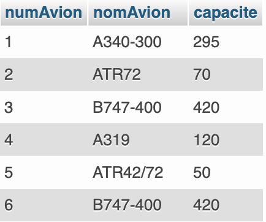
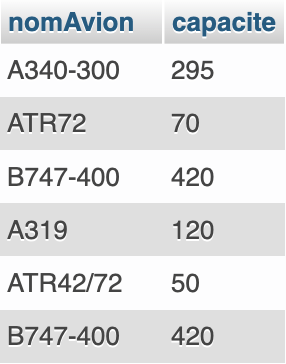
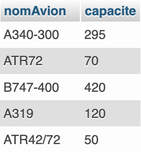

# Langage de manipulation des données


## 1. Base de données de travail

La base de données ci-dessous sera utilisée pour illustrer les commandes de base du langage de manipulation de données SQL.

### 1.1 Représentation graphique


### 1.2 Représentation en intention

**Pilotes**(<u>numPilote</u>, nomPilote, adresse, salaire, bonus)
**Avion**(<u>numAvion</u>, nomAvion, capacite)
**Vols**(<u>numVol</u>, \#numAvion, \#numPilote, villeDepart, heureDepart, villeArrivee, heureArrivee)


### 1.3 Représentation détaillée

**Pilotes** (<u>numPilote</u>, nomPilote, adresse, salaire, bonus)
​        numPilote : clef primaire

**Avions** (<u>numAvion</u>, nomAvion, capacite)
​        numAvion : clef primaire

**Vols** (<u>numVol</u>, numAvion, numPilote, villeDepart, heureDepart, villeArrivee, heureArrivee)
​        numVol : clef primaire
​		numAvion : clef étrangère en référence à numAvion de Avions
​		numPilote : clef étrangère en référence à numPilote de Avions


<div style="page-break-after:always" />
## 2. Consultation des données

La consultation (ou l’interrogation) des données constitue l’opération la fréquente en langage SQL. Elle est réalisée en utilisant la commande **SELECT**.

*Note* : Les instructions entre crochets sont facultatives.

```sql
    SELECT [ALL] | [DISTINCT] <liste des noms de colonnes> | *
    FROM <Liste des tables>
    [WHERE <condition logique>]
    [ORDER BY ...]
    [GROUP BY ...]
    [HAVING ...]
```

| = c'est soit l'un ou l'autre
Select = qu'est-ce que je souhaite afficher ?
From = où se trouve-t-il ?

### 2.1 Consultation simple

Cette opération permet de sélectionner une partie des champs (les colonnes) d'une ou plusieurs tables.

> **R1** *: « Quels renseignements possédons-nous sur tous les avions ? »*
> 
> <div style="text-align:left;margin-left:40px;">
>     
> </div>

Tous les enregistrements de la table Avions sont sélectionnés. La consultation peut être limitée à un choix de colonnes en indiquant une liste de noms de champs à la place de l'astérisque.

> **R2** *: « Quels sont les noms et les capacités des avions de la compagnie? »*
> 
> <div style="text-align:left;margin-left:40px;">
>     
> </div>


La clause **DISTINCT** ajoutée à la clause **SELECT** permet d’éliminer les doublons. Si dans le résultat plusieurs enregistrements sont identiques, un seul sera conservé.

> **R3** *: « Quels sont les différents avions de la compagnie et leur capacité ? »*
> 
> <div style="text-align:left;margin-left:40px;">
>     
> </div>

*Note* : L'option **ALL** est, par opposition à l'option **DISTINCT**, l'option par défaut. Elle permet de sélectionner l'ensemble des enregistrements.


### 2.2 Consultation avec restriction

L'objectif est de sélectionner des lignes d'une ou plusieurs tables selon certains critères. La clause **WHERE** suivie d'une condition logique va permettre de filtrer les lignes affichées. La condition est une expression logique ayant soit la valeur « VRAI », soit la valeur « FAUX. » Elle sera évaluée pour chaque enregistrement de la table. Seuls les enregistrements pour lesquels la condition est à « VRAI » seront conservés.


#### 2.2.1 Conditions logiques

C’est le résultat de la comparaison de deux expressions au moyen d’un opérateur de comparaison :

- **Égalité, différence…** : 􏰁= ; != ou <> ; > ; < ; <= ; >=

- **Le prédicat BETWEEN** permet de vérifier qu'une valeur se trouve dans un intervalle.
```sql
    expression BETWEEN <expression 1> AND <expression 2>
```

- **Le prédicat LIKE** permet de faire des comparaisons sur des chaînes grâce à des caractères, appelés caractères jokers :
    - le caractère **%** permet de remplacer une séquence de caractères (éventuellement nulle),
    - le caractère **_** permet de remplacer un caractère (l'équivalent du "blanc" au scrabble),
    - les caractères **[-]** permettent de définir un intervalle de caractères, par exemple [A-D].

```sql
    expression LIKE "chaîneDeCaractères"
    expression LIKE "toto%"
    expression LIKE "_toto"
```

- **Le prédicat IN** permet de vérifier qu'une valeur appartient à une liste de valeurs :
```SQL
    expression IN (<expression 1, expression 2, ...>)
```

Les opérateurs logiques **AND** et **OR** pourront aussi être utilisés pour combiner plusieurs conditions.

> **R4** *: « Quels sont les avions de capacité supérieure ou égale à 100 ? »*
>
> ```sql
> SELECT capacite
> FROM `Avions`
> WHERE capacite >=100
> ```
>
> **R5** *: « Quels sont les pilotes (nomPilote, bonus et salaire) dont le bonus est supérieur au salaire ? »*

> ```sql
> SELECT nomPilote, bonus, salaire
> FROM `Pilotes`
> WHERE bonus>salaire;
> ```

> **R6** *: « Quels sont les pilotes dont le bonus est compris entre 800 et 1000 € ? »*
>
> ```sql
> SELECT bonus
> FROM `Pilotes`
> WHERE bonus BETWEEN 800 AND 1000;
> ```
>
> **R7** *: « Quels sont les pilotes dont le nom commence par "DUP" ? »*

> ```sql
> SELECT nomPilote
> FROM `Pilotes`
> WHERE nomPilote LIKE "DUP%";
> ```
>
> **R8** *: « Quels sont les numéros des vols dont la ville d’arrivée est "GILLOT" ou "MAURICE" ? »*

> <div style="text-align:left;margin-left:40px;">
>  
> </div>

**Remarque :** l’opérateur **AND** est prioritaire par rapport à l’opérateur **OR**.

> **R9** *: « Quels sont les pilotes dont le bonus est inférieur à 800 € (peu importe la ville où ils résident) et ceux dont le salaire est inférieur à 3500 € mais habitant Paris ? »*
>
> ```sql
> SELECT *
> FROM `Pilotes`
> WHERE bonus < 800 OR (salaire < 3500 AND adresse LIKE "%PARIS");
> ```

> **R10** *: « Quels sont les pilotes habitant à Ste-Marie ou à St-Denis et dont le bonus est supérieur à 1000 € ? »*
>
> ```sql
> SELECT nomPilote
> FROM `Pilotes`
> WHERE bonus > 1000 AND (adresse LIKE "%DENIS" OR adresse LIKE "%MARIE");
> ```

#### 2.2.2 Restriction sur une valeur manquante

Lorsqu'un champ n'est pas renseigné, le SGBD lui attribue une valeur spéciale que l'on note **NULL**. La recherche de cette valeur ne peut pas se faire à l'aide des opérateurs classiques : il faut utiliser les prédicats **IS NULL** ou bien **IS NOT NULL**. Cette valeur spéciale est systématiquement ignorée dans tous les calculs.

> **R11** *: « Quels sont les pilotes n’ayant pas de bonus ? »*
>
> ```sql
> SELECT *
> FROM `Pilotes`
> WHERE bonus = 0 OR bonus IS NULL;
> ```