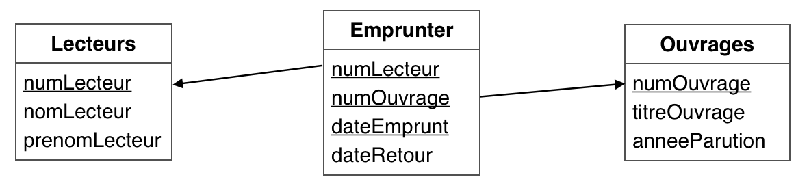

# LMD, évaluation 3





**R1 :** *Quel sont les emprunts (numLecteur et numOuvrage suffisent) du 11 janvier 2016 ?*
```sql
SELECT numLecteur, numOuvrage
FROM Emprunter
WHERE dateEmprunt LIKE "2016-01-11";
```


**R2 :** *Quels sont les ouvrages dont le titre se termine par la lettre « R » ?*

```sql
SELECT CONCAT(titreOuvrage, ' (', anneeParution, ')') AS Ouvrages
FROM Ouvrages
WHERE titreOuvrage LIKE '%R'
```


**R3 :** *Quels sont les lecteurs qui portent le nom (ou le prénom) « BERTRAND » ?*

```sql
SELECT CONCAT(prenomLecteur, ' ', nomLecteur) AS nom
FROM Lecteurs
WHERE
    nomLecteur LIKE '%BERTRAND%'
    OR prenomLecteur LIKE '%BERTRAND%';
```
**ou bien**

```sql
SELECT CONCAT(prenomLecteur, ' ', nomLecteur) AS nom
FROM Lecteurs
WHERE CONCAT(prenomLecteur, nomLecteur) LIKE '%BERTRAND%';
```


**R4 :** *Quels sont les emprunts (numLecteur et numOuvrage suffisent) correspondant à un emprunt en 2016 ?*

```sql
SELECT numLecteur, numOuvrage
FROM Emprunter
WHERE dateEmprunt LIKE "2016%"
```
**ou bien**
```sql
SELECT numLecteur, numOuvrage
FROM Emprunter
WHERE YEAR(dateEmprunt) = 2016
```
**ou bien**
```sql
SELECT numLecteur, numOuvrage
FROM Emprunter
WHERE dateEmprunt >= "2016-01-01" AND dateEmprunt <= "2016-12-31"
```
**ou bien**
```sql
SELECT numLecteur, numOuvrage
FROM Emprunter
WHERE dateEmprunt BETWEEN "2016-01-01" AND "2016-12-31"
```


**R5 :** *Quels sont les lecteurs (nom et prénom) ayant emprunté un ouvrage sur « Java » ?*

```sql
SELECT CONCAT(prenomLecteur, ' ', nomLecteur) AS nom
FROM Lecteurs
    INNER JOIN Emprunter
            ON Lecteurs.numLecteur = Emprunter.numLecteur
        INNER JOIN Ouvrages
                ON Emprunter.numOuvrage = Ouvrages.numOuvrage

WHERE
    titreOuvrage LIKE '%Java%';
```


**R6 :** *Quel est le nom des lecteurs ayant effectué au moins un emprunt depuis le début de l’année 2013 ?*
```sql
SELECT DISTINCT CONCAT(prenomLecteur, ' ', nomLecteur) AS nom
FROM Lecteurs
    INNER JOIN Emprunter
            ON Lecteurs.numLecteur = Emprunter.numLecteur
WHERE
    YEAR(dateEmprunt) >= 2013;
```


***Question bonus :** comment afficher les ouvrages disponibles qui n’ont jamais été empruntés ?*

```sql
SELECT titreOuvrage
FROM Ouvrages
WHERE Ouvrages.numOuvrage NOT IN (	SELECT DISTINCT numOuvrage
                                    FROM Emprunter)
```
**ou bien**
```sql
SELECT titreOuvrage
FROM Ouvrages
    LEFT JOIN Emprunter
            ON Ouvrages.numOuvrage = Emprunter.numOuvrage
WHERE Emprunter.numOuvrage IS NULL
```


**R7 :** *Quels sont les livres empruntés, c'est-à-dire non disponibles, avec pour chacun, le titre et l'année de parution de l’ouvrage, le nom du lecteur et la date d’emprunt ?*
```sql
SELECT CONCAT(titreOuvrage, ' (', anneeParution, ')'), nomLecteur, dateEmprunt
FROM Ouvrages
    INNER JOIN Emprunter
            ON Ouvrages.numOuvrage = Emprunter.numOuvrage
        INNER JOIN Lecteurs
                ON Emprunter.numLecteur = Lecteurs.numLecteur
WHERE
    Emprunter.dateRetour IS NULL;
```


**R8 :** *Quel est le nombre total d’emprunts déjà rendus à ce jour ?*
```sql
SELECT COUNT(*) AS 'Nbre Emprunts'
FROM Emprunter
WHERE dateRetour IS NOT NULL
```
**ou bien**
```sql
SELECT COUNT(dateRetour) AS 'Nbre Emprunts'
FROM Emprunter
```


**R9 :** *Quels sont les nom et prénom des lecteurs ayant rendu un livre durant la première année d'emprunts dans la bibliothèque ?*
```sql
SELECT CONCAT(prenomLecteur, ' ', nomLecteur) AS nom
FROM Lecteurs
    INNER JOIN Emprunter
            ON Lecteurs.numLecteur = Emprunter.numLecteur
WHERE YEAR(dateRetour) = ( SELECT MIN(YEAR(dateEmprunt))
                           FROM Emprunter)
```


**R10 :** *Quel est le nombre total d’emprunts effectués par année d'emprunt, triés par nombre décroissant ?*

```sql
SELECT COUNT(*) AS nbreEmpruntes
FROM Emprunter
WHERE 1
GROUP BY YEAR(dateEmprunt)
ORDER BY nbreEmpruntes DESC;
```


**R11 :** *Enregistrer le retour de l’ouvrage n°17 à la date du jour.*

```sql
UPDATE Emprunter
SET dateRetour = now()
WHERE
    numOuvrage = 17
    AND dateRetour IS NULL;
```


**R12 :** *Supprimer tous les emprunts de Bertrand INAUD de l’année 2013, mais restitués depuis.*
*Aucun demi-point possible sur cette question.*

```sql
DELETE
FROM Emprunter
WHERE
    numLecteur = ( SELECT numLecteur
                   FROM Lecteurs
                   WHERE nomLecteur LIKE 'INAUD'
                       AND prenomLecteur LIKE 'Bertrand')
    AND dateEmprunt LIKE '2013%'
    AND dateRetour IS NOT NULL
```
**ou bien**

```sql
DELETE Emprunter
FROM Emprunter
    INNER JOIN Lecteurs
            ON Emprunter.numLecteur = Lecteurs.numLecteur
WHERE
    dateEmprunt LIKE '2013%'
    AND dateRetour IS NOT NULL
    AND nomLecteur LIKE 'INAUD'
    AND prenomLecteur LIKE 'Bertrand'
```

