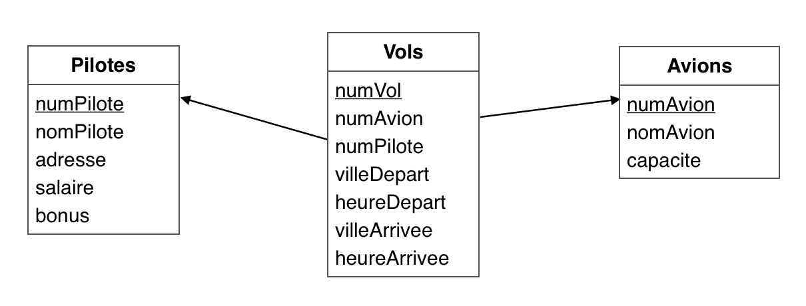
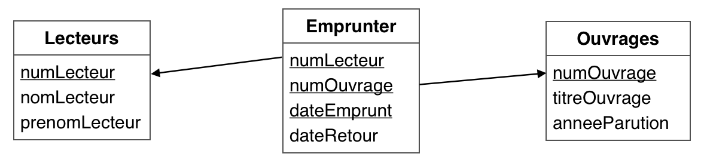

CCI - SIO, le 13/12/2021
<div style:"clear:both;"></div>

# LMD, évaluation 2





**R1 :** *Quels sont les vols (numVol) triés par ordre croissant, assurés par Toto ?*

```sql
SELECT numVol
FROM `Vols`
INNER JOIN Pilotes
ON Vols.numPilote=Pilotes.numPilote
WHERE nomPilote LIKE "TOTO"
ORDER BY numVol ASC;
```

**R2 :** *Combien de vols y a-t-il au départ de Gillot ?*

```sql
SELECT COUNT(*) AS nbreVols
FROM
WHERE villeDepart
```

**R3 :** *Combien de vols sont assurés par des ATR ?*

**R4 :** *Quels sont les emprunts (titres et dates) réalisés par le lecteur nommé « HAMSI » ?*
